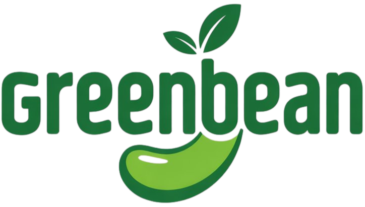

<p align="center">
  
</p>

<h1 align="center">GreenBean</h1>

<p align="center">
  <strong>Digital Wellness & Business Resources</strong><br/>
  Empowering healthier living, improved productivity, and sustainable financial growth.
</p>

<p align="center">
  <a href="https://greenbeanproducts.vercel.app" target="_blank">🌐 Live Site</a> •
  <a href="https://www.instagram.com/yournutritionist8" target="_blank">📸 Instagram</a> •
  <a href="mailto:hellogreenbeanwellness@gmail.com">✉️ Email Us</a>
</p>

---

## About

GreenBean is a digital wellness and business resource platform providing high-quality **ebooks**, **templates**, **planners**, and **online courses** designed to support healthier living, improved productivity, and sustainable financial growth.

We help individuals build better habits, enhance their nutrition and wellbeing, and develop practical skills for entrepreneurship and passive income.

---

## What We Offer

### 🌿 Health & Nutrition

Meal planners, healthy recipe ebooks, weight management guides, and gut health programs.

### 🧘 Wellbeing & Lifestyle

Habit trackers, self-care journals, mental wellness workbooks, and stress management courses.

### 💼 Business & Productivity

Business plan templates, social media planners, passive income guides, and freelancing starter kits.

### 📚 Online Courses

Self-paced courses on building wellness routines and starting a digital product business.

---

## Tech Stack

| Technology          | Purpose                         |
| ------------------- | ------------------------------- |
| **Next.js 16**      | React framework with App Router |
| **Tailwind CSS v4** | Utility-first styling           |
| **shadcn/ui**       | Accessible UI components        |
| **GSAP**            | Scroll & entrance animations    |
| **next-themes**     | Dark / Light theme support      |
| **Lucide Icons**    | Icon system                     |
| **TypeScript**      | Type safety                     |

---

## Getting Started

```bash
# Install dependencies
npm install

# Run development server
npm run dev
```

Open [http://localhost:3000](http://localhost:3000) in your browser.

---

## Project Structure

```
├── app/
│   ├── page.tsx          # Homepage
│   ├── shop/             # Shop page with product filtering
│   ├── about/            # About us
│   ├── contact/          # Contact form & info
│   ├── faq/              # Frequently asked questions
│   ├── privacy/          # Privacy policy
│   └── terms/            # Terms & conditions
├── components/
│   ├── sections/         # Homepage sections (Hero, Features, etc.)
│   ├── navbar.tsx        # Responsive sticky navbar
│   ├── footer.tsx        # Multi-column footer
│   ├── product-card.tsx  # Reusable product card
│   └── ui/               # shadcn/ui components
├── hooks/                # Custom hooks (GSAP animations)
└── lib/                  # Utilities & centralized data
```

---

## Contact

- **Email:** hellogreenbeanwellness@gmail.com
- **Phone/WhatsApp:** +234 8055926243 | +234 8035540719
- **Hours:** Mon–Fri | 9 AM – 5 PM (WAT)
- **Instagram:** [@yournutritionist8](https://www.instagram.com/yournutritionist8)

---

<p align="center">
  © 2026 GreenBean. All rights reserved. Serving customers globally.
</p>
